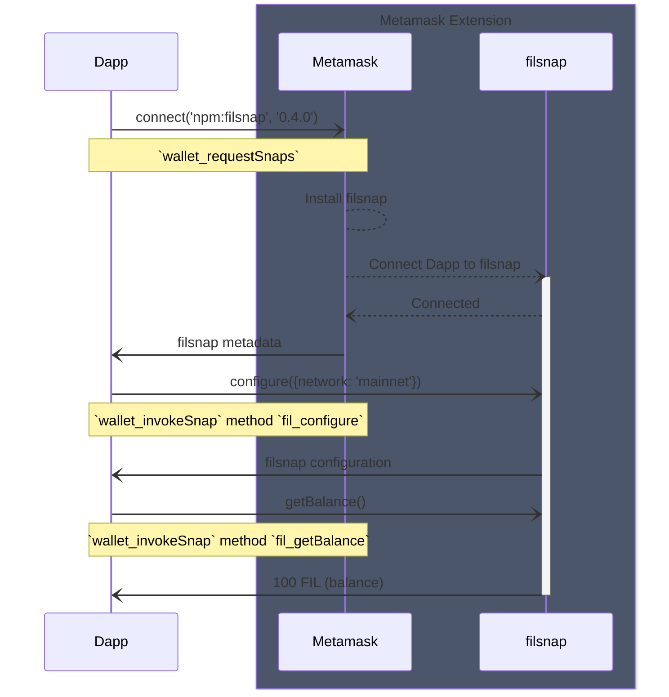

# filsnap

[](https://www.npmjs.com/package/filsnap)
[](https://opensource.org/licenses/MIT)
[](https://opensource.org/licenses/Apache-2.0)
[](https://github.com/filecoin-project/filsnap/actions/workflows/snap.yml)

> Connect to Filecoin dapps using Metamask. Manage Filecoin accounts, send FIL to Native and FEVM accounts and enable FEVM transaction insights.

## Usage

You can install and use filsnap using the Metamask provider.

```js
// Install filsnap
try {
  const result = await window.ethereum.request({
    method: 'wallet_requestSnaps',
    params: {
      'npm:filsnap': {
        version: '^0.4.0', // Optional, defaults to latest
      },
    },
  })

  console.log(result)
  /**
{
  'npm:filsnap': {
    version: '1.0.0',
    id: 'npm:filsnap',
    enabled: true,
    blocked: false,
  },
}
   */
} catch (error) {
  console.log(error)
}
```

```js
// Get filsnap metadata
const result = await window.ethereum.request({ method: 'wallet_getSnaps' })

console.log(result)
/**
{
  'npm:filsnap': {
    version: '1.0.0',
    id: 'npm:filsnap',
    enabled: true,
    blocked: false,
  },
}
 */
```

```js
// Get filsnap metadata
const result = await window.ethereum.request({
  method: 'wallet_invokeSnap',
  params: { snapId: 'npm:filsnap', method: 'fil_getBalance' },
})

console.log(result)
/**
{
  result: '100699819802794525019',
  error: null
}
 */
```

We recommend using [`filsnap-adapter`](../adapter) to interact with filsnap for a simpler interface. Check the full API documentation [here](https://filecoin-project.github.io/filsnap/).

### RPC Methods

- `fil_configure` - Configure the snap.
- `fil_getBalance` - Get the balance of the connected account.
- `fil_getAddress` - Get the address of the connected account.
- `fil_getPublicKey` - Get the public key of the connected account.
- `fil_getAccountInfo` - Get the account info of the connected account.
- `fil_getGasForMessage` - Get the gas for a message.
- `fil_signMessage` - Sign a message with the connected account.
- `fil_signMessageRaw` - Sign a raw message (string) with the connected account.
- `fil_exportPrivateKey` - Export the private key of the connected account.
- `fil_sendMessage` - Send a message.

Check the full RPC methods documentation [here](https://filecoin-project.github.io/filsnap/interfaces/filsnap.FilSnapMethods.html).

## Architecture



## Current limitations

- Multiple accounts are not supported yet. Only the first account is used.
  - One workaround currently supported is to use the derivation path from the configuration to get the account you want to use.
- Ledger is not supported, this is a **Metamask limitation**.
- There's no UI native in the extension for the user to interact with the snap, this is a **Metamask limitation**.
- Transaction insights are supported but forces the Filsnap tab to be opened even if the snap doesn't return any data. This is a **Metamask limitation**.

## Recommendations for future work

- Add support for multiple accounts.
- Sync with Metamask team to work through the limitations.

## Contributing

Read contributing guidelines [here](../../.github/CONTRIBUTING.md).

[](https://codespaces.new/filecoin-project/filsnap)

## License

Dual-licensed: [MIT](../../LICENSE-MIT), [Apache Software License v2](../../LICENSE-APACHE), by way of the
[Permissive License Stack](https://protocol.ai/blog/announcing-the-permissive-license-stack/).
